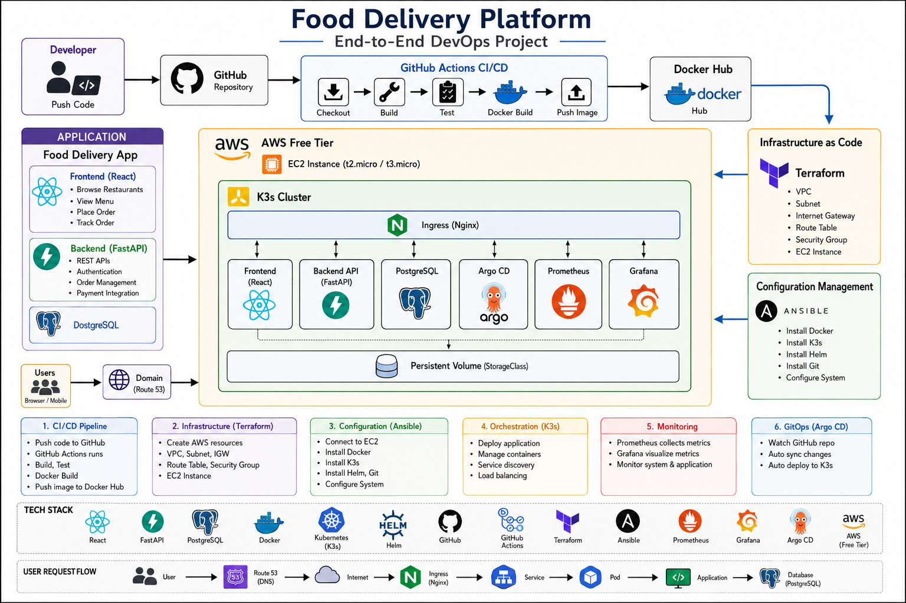
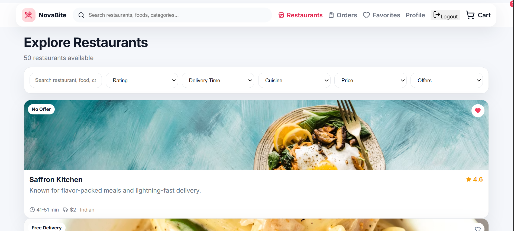
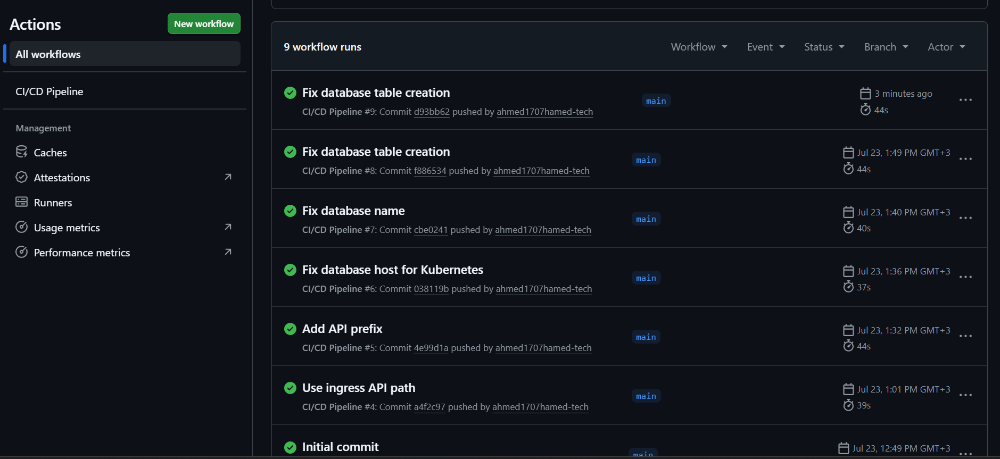
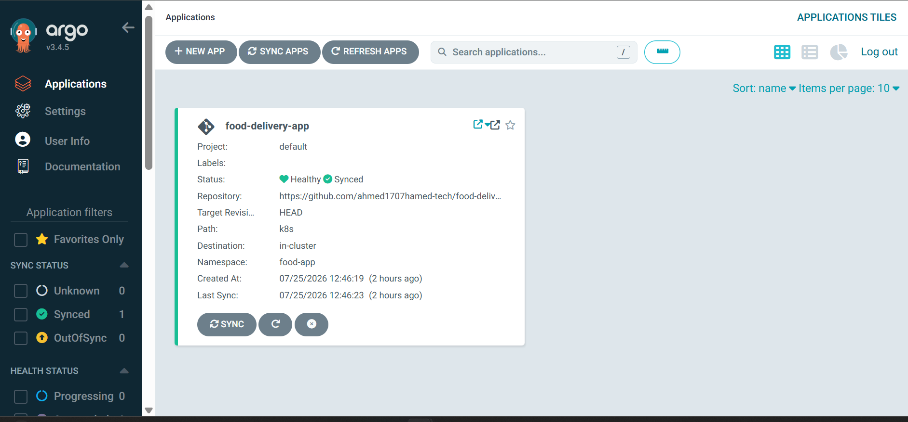
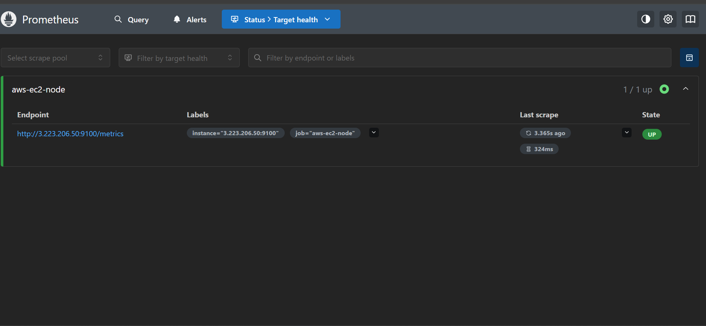
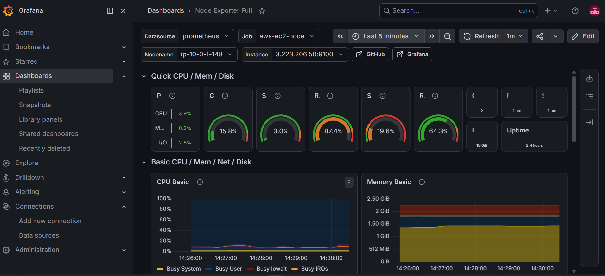

<div align="center">

# 🍔 Food Delivery Platform
### End-to-End DevOps Project on AWS

<p align="center">


</p>

Production-ready Cloud Native Food Delivery Platform demonstrating a complete DevOps lifecycle from Infrastructure Provisioning to GitOps deployment and Monitoring.

</div>

---

# 📑 Table of Contents

- Overview
- Architecture
- Demo
- Tech Stack
- Project Structure
- DevOps Workflow
- Infrastructure
- Configuration Management
- CI/CD Pipeline
- Kubernetes Deployment
- Monitoring
- GitOps
- Screenshots
- Deployment Guide
- Future Improvements
- Author

---

# 🚀 Overview

This project demonstrates how modern DevOps practices can automate the entire software delivery lifecycle.

The platform is deployed on **AWS EC2** using a lightweight **K3s Kubernetes Cluster**. Infrastructure is provisioned with Terraform, server configuration is automated with Ansible, Docker images are built and pushed using GitHub Actions, deployments are managed by Argo CD following GitOps principles, and monitoring is implemented with Prometheus and Grafana.

---

# 🏗 Architecture

<p align="center">



</p>

---

# 🎥 Project Demo

## Food Delivery Application

<p align="center">



</p>

---

# ⚡ Technology Stack

| Layer | Technologies |
|---------|-------------|
| Frontend | React |
| Backend | FastAPI |
| Database | PostgreSQL |
| Containers | Docker |
| Registry | Docker Hub |
| CI/CD | GitHub Actions |
| Infrastructure | Terraform |
| Configuration | Ansible |
| Orchestration | K3s Kubernetes |
| Ingress | NGINX Ingress |
| GitOps | Argo CD |
| Monitoring | Prometheus + Grafana |
| Cloud | AWS EC2 |

---

# 📁 Project Structure

```text
Food-Delivery-Platform
│
├── frontend/
├── backend/
├── terraform/
├── ansible/
├── k8s/
├── monitoring/
├── .github/
│   └── workflows/
├── docs/
│   └── images/
└── README.md
```

---

# 🔄 DevOps Workflow

```text
Developer

     │

Push Code

     │

GitHub Repository

     │

GitHub Actions

     │

Build

     │

Run Tests

     │

Build Docker Images

     │

Push Docker Images

     │

Terraform Infrastructure

     │

Ansible Configuration

     │

K3s Cluster

     │

Argo CD

     │

Deploy Application

     │

Prometheus + Grafana

     │

Production
```

---

# ☁ Infrastructure Provisioning

Infrastructure is fully automated using Terraform.

Resources created include:

- VPC
- Public Subnet
- Internet Gateway
- Route Table
- Security Group
- EC2 Instance

---

# ⚙ Configuration Management

Ansible automatically configures the EC2 instance by:

- Installing Docker
- Installing K3s
- Installing Helm
- Configuring Git
- Preparing Kubernetes Environment

---

# 🚀 CI/CD Pipeline

Every push to the **main** branch automatically triggers GitHub Actions.

Pipeline stages include:

- Checkout Repository
- Install Dependencies
- Build Application
- Docker Build
- Push Images to Docker Hub

---

## GitHub Actions

<p align="center">



</p>

---

# ☸ Kubernetes Deployment

The application is deployed on a K3s cluster using Kubernetes manifests.

Services include:

- React Frontend
- FastAPI Backend
- PostgreSQL Database

Features:

- Service Discovery
- Rolling Updates
- Self Healing
- Persistent Storage
- NGINX Ingress

---

# 🔄 GitOps with Argo CD

Argo CD continuously monitors the GitHub repository.

Whenever Kubernetes manifests are updated:

- Detect Changes
- Sync Automatically
- Deploy New Version
- Maintain Desired State

---

## Argo CD Dashboard

<p align="center">



</p>

---

# 📊 Monitoring

Prometheus collects infrastructure and application metrics from the Kubernetes cluster.

Metrics include:

- CPU Usage
- Memory Usage
- Disk Usage
- Network Traffic
- Node Health

---

## Prometheus

<p align="center">



</p>

---

## Grafana Dashboard

<p align="center">



</p>

---

# 🌐 User Request Flow

```text
User
   │
Browser
   │
Internet
   │
NGINX Ingress
   │
Kubernetes Service
   │
Frontend Pod
   │
Backend Pod
   │
PostgreSQL
```

---

# 📸 Screenshots

## Architecture


---

## Food Delivery Application


---

## GitHub Actions


---

## Argo CD


---

## Prometheus


---

## Grafana


---

# ⚙ Deployment

Clone the repository

```bash
git clone https://github.com/YOUR_USERNAME/Food-Delivery-Platform.git
```

Initialize Terraform

```bash
terraform init
terraform apply
```

Configure the EC2 Instance

```bash
ansible-playbook site.yml
```

Deploy Kubernetes Resources

```bash
kubectl apply -f k8s/
```

Verify

```bash
kubectl get pods
kubectl get svc
```

---

# ✨ Features

- Infrastructure as Code (Terraform)
- Configuration Management (Ansible)
- Dockerized Services
- Automated CI/CD
- Kubernetes Deployment
- GitOps with Argo CD
- Monitoring with Prometheus
- Dashboards with Grafana
- Persistent Volumes
- NGINX Ingress
- Cloud Deployment on AWS
- Production-ready Architecture

---

# 📚 Future Improvements

- HTTPS using Let's Encrypt
- Horizontal Pod Autoscaler (HPA)
- External Load Balancer
- Multi-Environment Deployment (Dev / Stage / Prod)
- Helm Charts
- Secrets Management with Vault
- Centralized Logging using ELK or Loki
- Slack Notifications
- SonarQube Integration

---

# 👨‍💻 Author

**Ahmed Mohammed Hamed**

Cloud & DevOps Engineer

- GitHub: https://github.com/ahmed1707hamed-tech
- LinkedIn: https://linkedin.com/in/YOUR-LINKEDIN

---

<div align="center">

⭐ If you found this project useful, don't forget to give it a Star!

</div>
